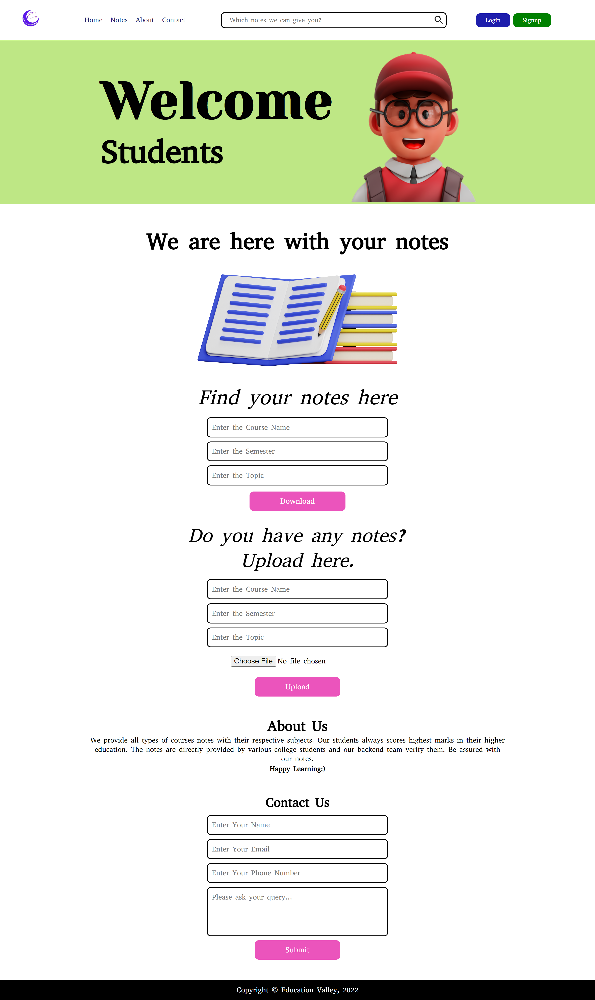

## ✨ Education Valley ✨
**This is the college notes providing website template.**

🔗 [Live Link](https://education-valley.netlify.app/)

 

## 📌 Problem Statement
The students of colleges are very busy with their career goals. So, it might be difficult for them to come to college on a regular basis and make notes for the exams. So, there should be a system that can help these students by providing the notes for every particular subject. 
So, here we are. We are building a solution for these college students, where they can access our website and read the notes for any subject they want.
 

## 📌 Novelty Of Our Idea
There will be a subject matter expert who will make notes on particular subjects. And students can access the notes by paying very little money. 
Now, the uniqueness here is that there will be a star rating for the subject matter experts. The more stars they collect from the students, the more they will be paid.

 

## 📌 Tech Stack

  

 

## 📌 Screenshots

 

## 💬 Team Name

[Hackitbros](https://www.hackitbros.co)

## 💬 Members Name

- **Sourabh**
[Linkdin](https://www.linkedin.com/in/sourabh-bhatt/) [Github](https://github.com/sourabh-bhatt)
- **Vishal**
[Linkdin](https://www.linkedin.com/in/vishal-kumar-909758228/) [Github](https://github.com/vishalkumar08376)